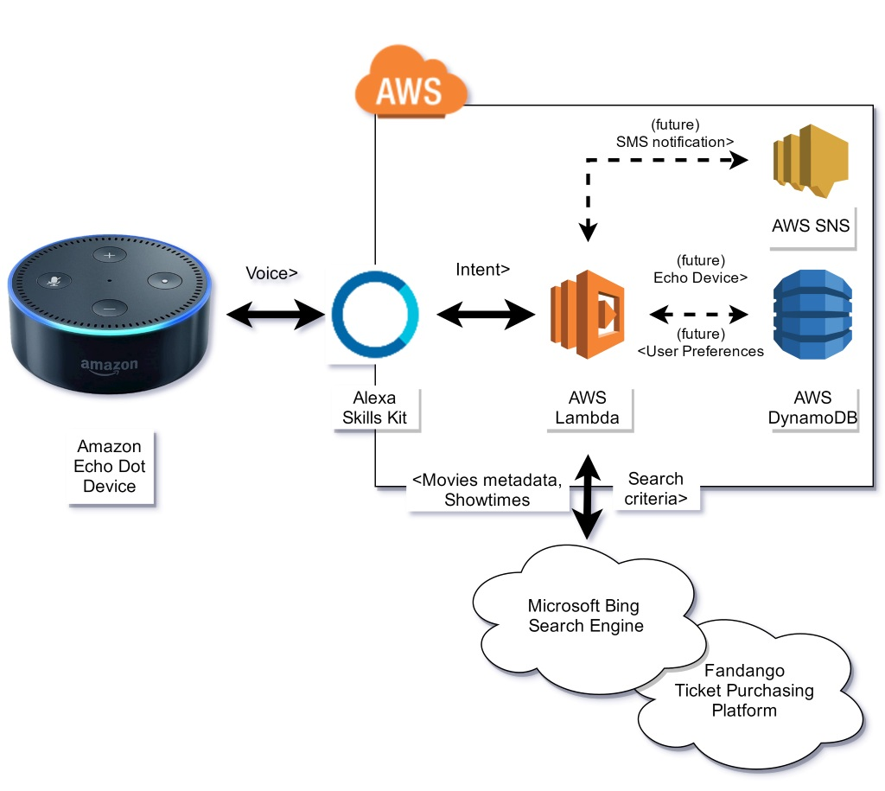
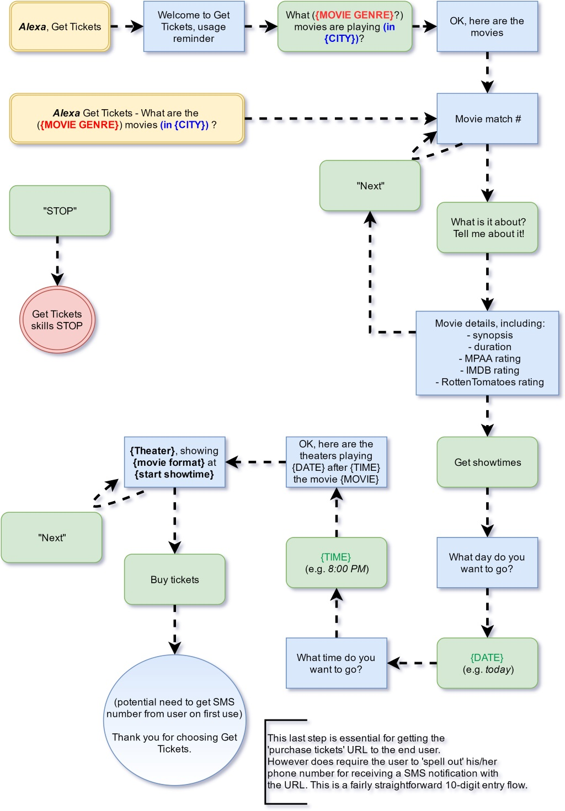

# GET TICKETS skill for Amazon Alexa

**Getting movie showtimes and tickets in a jiffy thanks to Alexa!**


# Update!

This project has been selected as a finalist in the [AWS re:Invent Alexa Skill Context 2016](https://www.hackster.io/contests/alexa-reinvent).

More details on the project/architecture and even a [demo video](https://youtu.be/miZGYJCwlLw) are present on the [context](https://www.hackster.io/rleyh/gettickets-c54778?ref=challenge&ref_id=82&offset=3) page.

# Introduction 

This skill allows users to find showtimes of movies currently available in theaters. The skill also provides quick movie selection, listening to the synopsis or ratings, to finally provides a ticket purchase link directly to the users' phone via a SMS text message.

# Requirements

You will need an [AWS Developer](https://developer.amazon.com) account, an Amazon Echo device (optional but preferred for better real-world testing) and some pop-corn!

# Getting Started

After cloning the repository, follow those steps to get this skill running.

1. Install [NodeJS](https://www.nodejs.com/) (version 6+ is preferred) if not already installed

2. Install [Typescript](https://www.npmjs.com/package/typescript) using ```npm install -g typescript``` if not already installed

3. Install all project-level dependencies

```
npm install
```

# Build and Test

## Pre-packaging

Do a search for ```// PUT YOUR``` in the code base to replace with your access key, ...

## AWS-Lambda package

This skill does package itself as a .zip file, that can be uploaded directly to your Alexa Skills Kit AWS Lambda function. 

We recommend you follow the Alexa walk-through to create a [Custom skill using an AWS Lambda function](https://developer.amazon.com/public/solutions/alexa/alexa-skills-kit/docs/developing-an-alexa-skill-as-a-lambda-function) using the sample *alexa-skills-kit-color-expert* Lambda template, and tweak it (as well as replace its code) afterwards.

### Windows-build machine

This skill was made using [VSCode](https://code.visualstudio.com) on a Windows OS machine, thus this is our supported scenario at this point. 

```
npm run package
```

This does create a ```bin/``` folder, get production-level NPM packages and Javascript code, and finally bundle it up into a `lambda.zip` file.

**NOTE**: This flow does require the [7ZIP](http://7-zip.org/)'s 7Z.exe to be placed in the ```.build/``` folder to generate the .zip file.

### OS-X build machine (and Linux-based machine)

The ```package.json``` script actions "package:clean" and "package:zip" need to be tweaked to be less-windows CMD specific. 7-zip can be easily swapped for the build-in zip tool.

## Setting the Interaction Model

Both [Intent Schema](https://developer.amazon.com/appsandservices/solutions/alexa/alexa-skills-kit/docs/defining-the-voice-interface#The Intent Schema) and [
Sample Utterances](https://developer.amazon.com/appsandservices/solutions/alexa/alexa-skills-kit/docs/defining-the-voice-interface#The Sample Utterances File) are to be set in order to get the skill working.

1. Open your Alexa Skill page on [AWS Developer](https://developer.amazon.com/)

2. Go to the Interaction Model tab

3. Copy and paste the contents of [schema/intents.json](schema/intents.json) onto the Intent Schema textbox

4. (If not already done), add a new Custom Slot Type, as *GENRE* with the following values:

```
Action 
Adventure 
Animated 
Biography 
Comedy 
Crime 
Documentary 
Drama 
Family 
Fantasy 
History 
Horror 
Musical 
Mystery 
Romance 
Sci-Fi
Science Fiction
Sport 
Suspense 
Thriller 
War 
Western
```

5. Copy and paste the contents of [schema/samples.txt](schema/samples.txt) onto the Sample Utterances textbox

## Local testing

Few sample queries for the showtime access layer can be run and tweaked locally.

```
npm run buildrun
```

# Architecture overview



# VUI diagram



# Future work

It is worth noting the AWS SNS and AWS DynamoDB integrations are for future development, respectively for sending the final purchase URL to the user via a SMS text message, and for storing user preferences, such as favorite city and/or zipcode, as well as favorite theater, favorite movie genres and phone number. While the current Get Ticket application leverages a 'card' for the movie being chosen, it doesn't allow the user to copy & paste or click through an hyperlink to complete the purchase - thus the use of SNS for sending an SMS message with this information.
The DynamoDB is to be used as persistent storage (as compared to the session-level storage offered by the Alexa Skills Kit for the skill) to store data across multiple sessions of the Get Tickets skill. Those can greatly help 'remembering' user past interactions, to help streamlining the Get Tickets experience.

# Contribute

Feel free to fork/branch and file issues!


Happy skill authoring!
